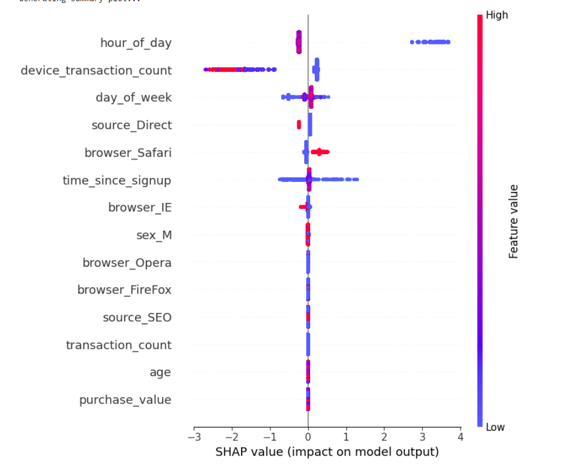
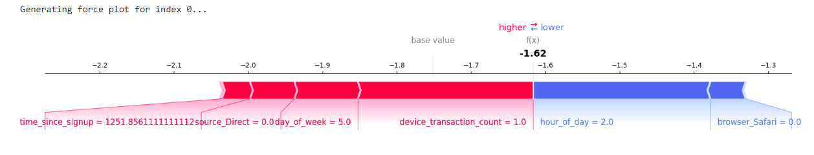

# Improved Detection of Fraud Cases for E-Commerce and Bank Transactions

This project aims to improve fraud detection in e-commerce and banking transactions using machine learning and explainability tools. It includes data cleaning, feature engineering, model training, evaluation, and SHAP-based model interpretation.

## 📁 Project Structure

```
Improved-detection-of-fraud-cases/
├── data/
├── models/
├── notebooks/
├── outputs/
│   └── images/
├── src/
├── tests/
├── README.md

```

## ✅ Objectives

- Clean and prepare two fraud-related datasets (e-commerce and credit card).
- Build and evaluate robust machine learning models for fraud detection.
- Use SHAP to explain model predictions and understand key fraud indicators.

## 🗃️ Datasets

1. **E-commerce Fraud Dataset**  
   - Includes features like `purchase_time`, `signup_time`, `source`, `browser`, `device_id`, `ip_address`, etc.

2. **Credit Card Transactions Dataset**  
   - Contains `user_id`, `card_id`, and fraud labels.

## 🧹 Task 1: Data Preprocessing & Feature Engineering

Implemented using `Preprocessor` and `FeatureEngineer` classes:

- Converted timestamps to datetime and extracted features like:
  - `time_since_signup`
  - `hour_of_day`
  - `day_of_week`
- Converted IP to integer format
- One-hot encoded categorical features like:
  - `source`, `browser`, `sex`
- Removed duplicates in credit data

**Output:** Cleaned and processed DataFrames saved to `data/`.

## 🤖 Task 2: Model Training & Evaluation

Trained both **Logistic Regression** and **XGBoost** with **SMOTE** on the imbalanced datasets.

### 🚀 Results on E-Commerce Dataset:

| Metric         | Logistic Regression | XGBoost      |
|----------------|---------------------|--------------|
| F1 Score       | 0.61                | **0.69**     |
| AUC-PR         | 0.67                | **0.71**     |
| Accuracy       | 0.91                | **0.96**     |

### 🚀 Results on Credit Dataset:

| Metric         | Logistic Regression | XGBoost      |
|----------------|---------------------|--------------|
| F1 Score       | 0.09                | **0.77**     |
| AUC-PR         | 0.72                | **0.78**     |
| Accuracy       | 0.97                | **1.00**     |

📦 **Best models saved to `models/`**.

## 📊 Task 3: SHAP Explainability

Used **SHAP (SHapley Additive exPlanations)** to interpret the predictions of the best XGBoost models.

### 🔍 Key Findings:

- **Top fraud indicators** for e-commerce:
  - `time_since_signup` (long delays = suspicious)
  - `source_Direct` (direct traffic patterns)
  - `device_transaction_count` (low activity = risk)
  - `hour_of_day`, `browser_Safari` (odd usage patterns)

### 📈 Summary Plot



### 📉 Force Plot

Explains an individual transaction’s prediction:



## 🧪 Tests

Unit tests implemented for all key components:
- `Preprocessor`
- `FeatureEngineer`
- `ModelTrainer`

Run with:
```bash
pytest tests/
```

## 📌 Tools & Libraries

- `pandas`, `numpy`, `matplotlib`, `seaborn`
- `scikit-learn`, `xgboost`, `imblearn`
- `shap`, `joblib`, `pytest`

## 📚 Author

- **Hawi Tesfaye**
- Tools: Python, Jupyter, SHAP, XGBoost
- Contact: [htesfaye.ht@gmail.com](mailto:htesfaye.ht@gmail.com)


